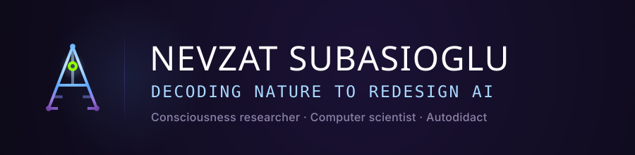

## Towards Truly Intelligent Systems: The Limits of Statistical Scale

For fifteen years I have worked on one question: how consciousness emerges in a human being. The
disposition you are born with, the schemas that form on top of it, the environment that shapes them,
and how the three interlock. The answer is not scale. Contemporary artificial intelligence confuses
computational density with genuine cognition, spending vast energy on high-dimensional curve fitting.
Nature demonstrates that biological systems achieve autonomy and reasoning through minimal, highly
integrated homeostatic loops. Having left traditional academic frameworks to pursue independent
meta-analysis, I design compact cognitive architectures that replace parameter inflation with genuine
intentionality.

> **Scaling parameters will never yield autonomy; biological systems compute with purpose, not sheer volume.**

## Research

Two papers carry this work. **From Mimicry to True Intelligence** draws the line that most definitions
of AGI blur: replicating human *performance* is not the same as replicating human *process*. It proposes
six components of genuine intelligence and a five-level taxonomy measurable against them.
**The Acceptance Gate** goes one level deeper, into the mechanism itself: what has to be true for any
agent to act against its own strongest schema. Detection, acceptance, override. The second station is
where it binds, because acceptance means letting a truth stand even when it threatens what your
self-worth rests on.

**[From Mimicry to True Intelligence (TI): A New Paradigm for Artificial General Intelligence](https://arxiv.org/abs/2509.14474)**
Meltem Subasioglu, Nevzat Subasioglu · arXiv, cs.AI / cs.CY · September 2025

**[The Acceptance Gate: Three Necessary Conditions for Acting Against One's Strongest Schema](https://doi.org/10.5281/zenodo.21401927)**
Nevzat Subasioglu · Preprint · July 2026

## Selected work

**acceptance-gate** is the preprint repository and interactive simulation tool exploring the
three-stage ceiling on cognitive schema override.

**true-intelligence** is the public architectural trajectory of True Intelligence, bridging
consciousness research with lean, biological AGI.
