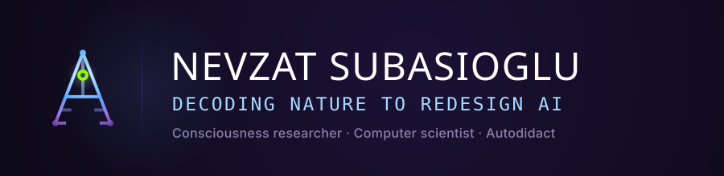

## Towards Truly Intelligent Systems: The Limits of Statistical Scale

For fifteen years I have worked on one question: how consciousness emerges in a human being. The
disposition you are born with, the schemas that form on top of it, the environment that shapes them,
and how the three interlock. The answer is not scale. Contemporary artificial intelligence confuses
computational density with genuine cognition, spending vast energy on high-dimensional curve fitting.
Nature demonstrates that biological systems achieve autonomy and reasoning through minimal, highly
integrated homeostatic loops. Having left traditional academic frameworks to pursue independent
meta-analysis, I design compact cognitive architectures that replace parameter inflation with genuine
intentionality.

> **Scaling parameters will never yield autonomy; biological systems compute with purpose, not sheer volume.**

## Research

Two papers carry this work. **From Mimicry to True Intelligence** draws the line that most definitions
of AGI blur: replicating human *performance* is not the same as replicating human *process*. It proposes
six components of genuine intelligence and a five-level taxonomy measurable against them.
**The Acceptance Gate** goes one level deeper, into the mechanism itself: what has to be true for any
agent to act deliberately on what its own schemata propose, rather than simply following them.
Detection, acceptance, override. The second station is where it binds, because acceptance means
letting a truth stand even when it threatens what your self-worth rests on. Autonomy here is the
examination, not the opposite move: the deliberate act may well end up looking the same.

**[From Mimicry to True Intelligence (TI) -- A New Paradigm for Artificial General Intelligence](https://arxiv.org/abs/2509.14474)**
Meltem Subasioglu, Nevzat Subasioglu · arXiv, cs.AI / cs.CY · September 2025

**The Acceptance Gate: Three Necessary Conditions for Acting Deliberately on What One's Schemata Propose**
Nevzat Subasioglu · Preprint · July 2026 · [code and worked cases](https://github.com/RealNevoEvo/acceptance-gate)

## Selected work

**[Why doesn't an intelligent person correct themselves?](https://realnevoevo.github.io/acceptance-gate/)**
The argument as a calculation you can follow. One surgeon, one day, two decisions that differ only
in what the correction would have cost her to admit.

**[acceptance-gate](https://github.com/RealNevoEvo/acceptance-gate)**
Companion code to the paper. One equation, no dependencies, and the worked cases from the manuscript
as executable tests. MIT, with a citation file.
